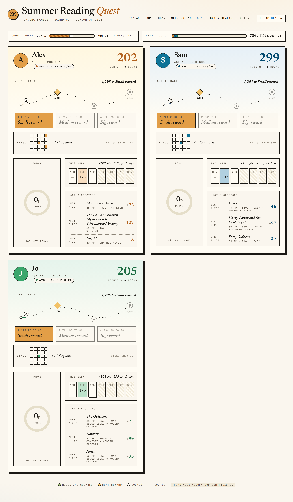
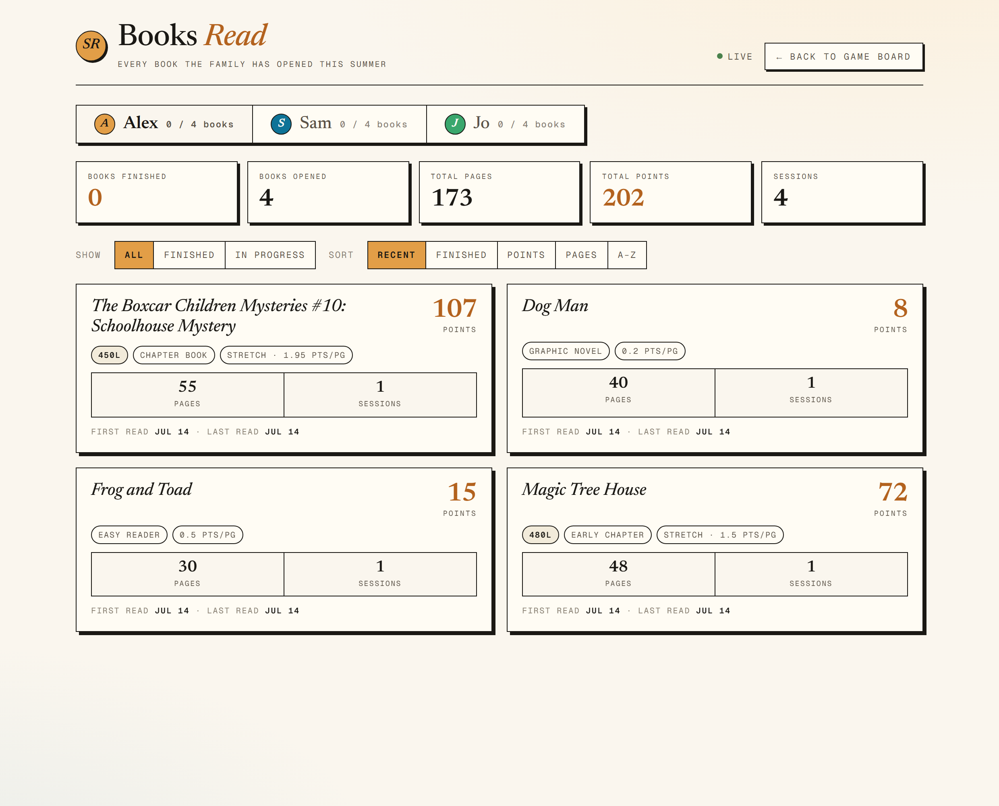

# reading-bot

A summer-reading game for families. Log what your kids read, score it by
book difficulty (Lexile) relative to *each reader's* level, and show it all on
a live game board with per-reader progress, a family points goal, streaks, and
a bingo card. Optional Mattermost slash commands, an Alexa skill, and Google
Calendar sync.

It started as a two-kid household project and is built so **adding a reader is
a config edit, not a code change** — see [`reader_config_example.py`](reader_config_example.py).

## Screenshots

The live **game board** — per-reader progress, a quest track toward rewards, a
bingo card, weekly activity, and the shared family goal (shown here with three
sample readers):



The **reading library** — every book each reader has opened, with Lexile,
format, tier, points, and pages:



## How scoring works

Every book has a Lexile measure. Each reader is assigned a **level** — a ladder
of Lexile boundaries (defined in [`readers.py`](readers.py), `LEVELS`) that maps a
book to a tier from *way&nbsp;below* to *big&nbsp;stretch*. Points per page scale
with the tier, so a book that's an easy read for an older reader is worth more
when a younger reader stretches into it. Format (graphic novel, easy reader,
chapter book…) and a per-book density factor adjust the rate further.

Seven levels ship by default (`emerging` → `advanced`); two readers can share
one, and you can tune the boundaries or add your own.

## Quick start

No clone or build needed — the published image (`amd64` + `arm64`) already
contains the app, the board UI, and the full book catalog. Just create a
`docker-compose.yml`:

```yaml
services:
  reading-bot:
    image: ghcr.io/mcrommert/reading-quest:latest
    ports:
      - "8602:8602"
    volumes:
      - ./data:/data     # persists reading.db across restarts + image updates
    restart: unless-stopped
```

then:

```bash
docker compose up -d
```

Open **http://localhost:8602/board/** — it runs with two sample readers out of
the box.

### Use your own family

Create a `reader_config.py` next to the compose file (schema in the next
section), then mount it — your data stays on your machine, never in the image:

```yaml
    volumes:
      - ./data:/data
      - ./reader_config.py:/app/reader_config.py:ro
```

`reader_config.py` is gitignored and never baked into any image.

### Build from source instead

Prefer to hack on it?

```bash
git clone https://github.com/mcrommert/reading-quest.git
cd reading-quest
cp docker-compose.example.yml docker-compose.yml   # then uncomment `build: .`
docker compose up -d --build
```

Or without Docker:

```bash
pip install -r requirements.txt
uvicorn app:app --host 0.0.0.0 --port 8602
```

## Configuring readers

Copy the example and edit `reader_config.py` (gitignored, so your family's real
data never gets committed):

```python
READERS = [
    {"key": "alex", "name": "Alex", "monogram": "A", "age": 7,
     "grade": "2nd grade", "level": "developing", "aliases": ["a"]},
    {"key": "sam",  "name": "Sam",  "monogram": "S", "age": 10,
     "grade": "5th grade", "level": "capable", "aliases": ["s"],
     "warn_upper_grade": True},
]
```

Each reader gets scoring, name resolution (key / name / aliases), a bingo card,
board presence, and a share of the family goal automatically. Readers without a
hand-authored bingo card get one generated from a default template.

## Endpoints

| Path | Purpose |
|---|---|
| `/log` | **Log reading from the browser** — mobile-friendly form + command bar |
| `/board/` | Desktop game board |
| `/board/ipad` | iPad kiosk view |
| `/library/` | Books-read library |
| `/board.json`, `/library.json` | Raw data |
| `/slash/read`, `/slash/reading`, `/slash/book`, `/slash/bingo` | Mattermost slash commands (optional) |
| `/alexa` | Alexa skill endpoint (optional, set `ALEXA_SKILL_ID`) |

## Logging reading

Open **http://localhost:8602/log** on a phone or the kitchen tablet. Pick a
reader, search the catalog (or add a new book), enter pages, and submit — it
scores the session instantly and updates the board. A command bar accepts the
same shorthand for power users:

```
alex "Frog and Toad Are Friends" pages=30 finished
```

Mattermost slash commands and the Alexa skill are **optional** extra input
paths — everything works from the browser with nothing else installed. Set
`LOG_PIN` to require a PIN before logging (recommended if the app is reachable
from outside your home network).

## Configuration

All configuration is via environment variables — see [`.env.example`](.env.example).
Everything is optional; with nothing set, the bot runs standalone with no
external integrations. Data persists in a SQLite file at `DB_PATH`
(default `/data/reading.db`).

## Known limitations

- The bundled book catalog ([`books.json`](books.json)) is one family's list —
  useful as a starting point; add your own with `/book`.

## License

MIT — see [LICENSE](LICENSE).
